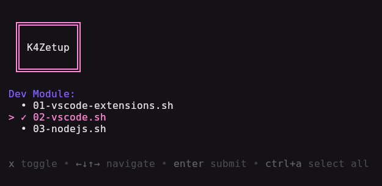

# K4zetup

Herramienta de configuración automatizada de sistemas escrita en Bash, diseñada para distribuciones basadas en Debian/Ubuntu. Permite instalar y configurar aplicaciones, herramientas de desarrollo, software de IA, juegos y otros paquetes de forma interactiva y modular.



>[!note] Nota
Este es un proyecto personal el cual hago para tener una replica de mis configuraciones e instalaciones que tengo en mi maquina. A pesar de que el script es bastante flexible y modular, hay ciertos componentes en los que estás atado a mis decisiones; como puede ser la instalacion de paquetes, extensiones o algunas herramientas.

>[!tip]
Podrás personalizar el script siguiendo la documentación: (pronto)

## Características

- **Interfaz interactiva** - Utiliza [Gum](https://github.com/charmbracelet/gum) para una experiencia visual amigable
- **Arquitectura modular** - Organización por categorías para fácil mantenimiento
- **Instalación selectiva** - El usuario elige qué módulos ejecutar
- **Soporte múltiple de paquetes** - apt, Flatpak y descargas directas (.deb)
- **Listas de paquetes editables** - Ficheros de configuración para personalizar instalaciones

## Requisitos

- Ubuntu
- `curl`:

  ```bash
  sudo apt install curl
  ```
- `gum`:

  ```bash
  sudo mkdir -p /etc/apt/keyrings
  curl -fsSL https://repo.charm.sh/apt/gpg.key | sudo gpg --dearmor -o /etc/apt/keyrings/charm.gpg
  echo "deb [signed-by=/etc/apt/keyrings/charm.gpg] https://repo.charm.sh/apt/ * *" | sudo tee /etc/apt/sources.list.d/charm.list
  sudo apt update && sudo apt install gum
  ```

>[!note] Nota
Este script está probado en ubuntu. Aunque deberia de funcionar bien en otras distros GNU/Linux basadas en debian/ubuntu.

## Instalación

```bash
git clone https://github.com/charmbracelet/gum.git
cd K4zetup
./install.sh
```

## Estructura

```
K4zetup/
├── install.sh              # Punto de entrada
├── core/
│   └── utils.sh            # Funciones utilitarias
└── modules/
    ├── 01-apps/            # Paquetes del sistema y Flatpak
    ├── 02-dev/             # VSCode, extensiones, Node.js
    ├── 03-ai/              # Herramientas de IA
    ├── 04-gaming/          # Steam
    └── 05-extra/           # Módulos adicionales
```

## Módulos

| Módulo | Contenido |
|--------|-----------|
| `01-apps` | curl, git, fastfetch, wget, blueman, vlc, Flatpak (Discord, Sober) |
| `02-dev` | VSCode, 10 extensiones, Node.js 24 via nvm |
| `03-ai` | Opencode |
| `04-gaming` | Steam |

## Uso

Al ejecutar `./install.sh` se presenta una interfaz visual donde seleccionas los módulos a instalar. Los scripts se ejecutan en orden secuencial con indicadores de progreso.

## Documentación

Pronto

## Autor

**K4rl0z**
